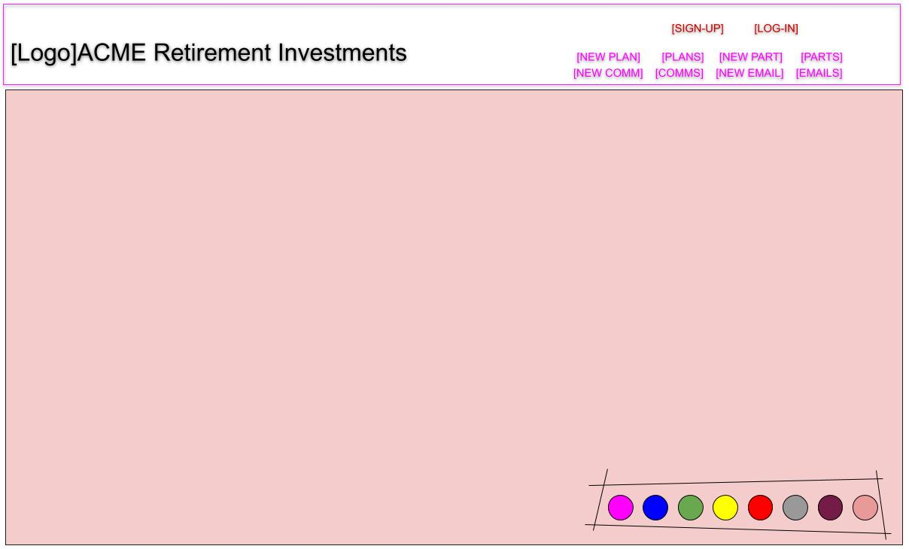

#  ⛱ <span style="color:red">ACME <span style="color:blue">Retirement Investments - <span style="color:green">Plans Participants Funds <span style="color:black">Frontend (Mohan's Project #4)

## 1. Technologies used

* HTML, CSS, JavaScript, Google Chrome
* React JavaScript Library rendering ACME Web Pages using Component based architecture
* Semantic UI React for Styling
* AXIOS the promise based Client HTTP Request processor
* REST (Representational state transfer) Architecture using JavaScript and JSON
* Postman API Client was used to test complex HTTP requests and returned JSONs
* Heroku Cloud Application Platform for Deployment
* Deployed at https://retireapp-frontend.herokuapp.com/

## 2. Learning Experience

* React Component based Architecture with state lifting, Conditional Rendering and Pages
* Simplicity of Semantic UI React for styling

## 3. Approach & Design Components - REST Table, Seeding, Git Repo Maintenance

### 3.1 Planning

<details>
  <summary>Click to expand!</summary>

     .
     ├── NOTES.txt
     ├── README.md                         Delete Plan
     ├── env.example                          src/plans/api.js (Has Get All and Delete One)
     ├── package-lock.json                        Func: const deletePlanByID = (id) => {
     ├── package.json                                   Calls axios.delete(`http://localhost:5000/api/plans/${id}`);
     ├── src                                      Backend, app/routes/plans.js ==>> router.delete('/api/plans/:id', (req, res) => { 
     │   ├── App.css                          src/plans/components/Plans.js (Calls both above)
     │   ├── App.js                               import { getAllPlans, deletePlanByID } from '../api';
     │   ├── App.test.js                          Func: deletePlan = (id) => {
     │   ├── index.css                            Func is passed to Plan.js - render() does the following 
     │   ├── index.js                                 return <Plan planName={plan.planName}              
     │   ├── logo.svg                                         planIsInstitutional={plan.planIsInstitutional}   
     │   ├── pages                                            id={plan._id}                   
     │   │   ├── api.js (New for add plan)                    deletePlan={this.deletePlan}                
     │   │   └── components                                   key={index} />;                                       
     │   │       ├── About.js                 src/plans/components/Plan.js (Calls above)                 
     │   │       ├── Detail.js                                                    
     │   │       ├── Holding.js                                                    
     │   │       ├── Investment.js          CREATE Backend is in app/routes/plans.js                                                
     │   │       ├── NewPlan.js               router.post('/api/plans', (req, res) => {                                     
     │   │       └── Participant.js             Plan.create(req.body.plan)                
     │   ├── plans                          1. Create src/pages/api.js Include Create logic. insertNewPlan()                         
     │   │   ├── api.js                     2. In src/pages/components/NewPlan.js                               
     │   │   └── components                     import { insertNewPlan } from '../api';       
     │   │       ├── Plan.js                    Construct Body and call the method (AXIOS call)                                
     │   │       ├── Plans.js                                                    
     │   │       └── EditPlan.js (Inline)                                                    
     │   ├── reportWebVitals.js                                                    
     │   ├── setupTests.js                                                    
     │   └── shared                                                    
     │       └── components                                                    
     │           └── Nav.js                                                    
     └── yarn.lock                                                    
</details>

### 3.2 REST Table

Each of tht Plan RESTful routes were coded based on the table below

<details>
  <summary>Click to expand!</summary>

<table>
<thead>
<tr>
<th>Rt#</th>
<th>Path</th>
<th>HTTP Verb</th>
<th>Purpose</th>
<th>Mongoose Method</th>
</tr>
</thead>
<tbody>
<tr>
<td>1</td>
<td>/plans</td>
<td>GET</td>
<td>List all plans </td>
<td>Plan.find()</td>
</tr>
<tr>
<td>2</td>
<td>/plans/new</td>
<td>GET</td>
<td>Show new plan form</td>
<td>N/A</td>
</tr>
<tr>
<td>3</td>
<td>/plans</td>
<td>POST</td>
<td>Create a new plan, then redirect somewhere</td>
<td>Plan.create()</td>
</tr>
<tr>
<td>4</td>
<td>/plans/:id</td>
<td>GET</td>
<td>Show info about one specific plan</td>
<td>Plan.findById()</td>
</tr>
<tr>
<td>5</td>
<td>/plans/:id/edit</td>
<td>GET</td>
<td>Show edit form for one plan</td>
<td>Plan.findById()</td>
</tr>
<tr>
<td>6</td>
<td>/plans/:id</td>
<td>PUT</td>
<td>Update particular plan, then redirect somewhere</td>
<td>Plan.findByIdAndUpdate()</td>
</tr>
<tr>
<td>7</td>
<td>/plans/:id</td>
<td>DELETE</td>
<td>Delete a particular plan, then redirect somewhere</td>
<td>Plan.findByIdAndRemove()</td>
</tr>
</tbody>
</table>
</details>

### 3.3 Wireframe


<details>
  <summary>Click to expand!</summary>


</details>

### 3.4 Git Repo, Checkpoints to roll back if necessary to ensure prompt delivery of the App

<details>
  <summary>Click to expand!</summary>

         >> git commit -m "Commit 01: First commit With README.md"
         >> git commit -m "Commit 02: Adding src/plans/components/plan.js"
         >> git commit -m "Commit 03: Adding src/plans/components/plans.js"
         >> git commit -m "Commit 04: src/plans/api.js"
         >> git commit -m "Commit 05: src/App.js"
         >> git commit -m "Commit 06: src/shared/components/Nav.js"
         >> git commit -m "Commit 07: Corrected Plan and Plans components file names"
         >> git commit -m "Commit 08: Added src/pages/components for Details"
         >> git commit -m "Commit 09: Fixes in pages components"
         >> git commit -m "Commit 10: Uploaded a full and clean copy"
         >> git commit -m "Commit 11: Intermediate - Adding C of CRUD (Add Plan)"
         >> git commit -m "Commit 12: Intermediate - Adding C of CRUD (Add Plan) Again"
         >> git commit -m "Commit 13: Intermediate - Adding C of CRUD (Add Plan) Completed"
         >> git commit -m "Commit 14: Intermediate - Adding U of CRUD (Update Plan) Form/Prefetch Completed"
         >> git commit -m "Commit 15: Intermediate - Update Ready except for inability to type in Edit Box"
         >> git commit -m "Commit 16: Intermediate - Except for ON - TRUE Mapping MVP is complete "
         >> git commit -m "Commit 17: Intermediate -  ON - TRUE Mapping MVP is complete "
         >> git commit -m "Commit 18: Intermediate "
         >> git commit -m "Commit 19: Intermediate - MVP Complete"
         >> git commit -m "Commit 20: MVP Complete"
         >> git commit -m "Commit 21: Attempting Semantic UI Styling"
         >> git commit -m "Commit 22: Semantic UI Styling and a log image"
         >> git commit -m "Commit 23: yarn.lock removed"
         >> git commit -m "Commit 24: yarn.lock removed"
         >> git commit -m "Commit 25: package.json"
         >> git commit -m "Commit 26: rm cache"
         >> git commit -m "Commit 27: removed public from .gitignore"
         >> git commit -m "Commit 28: parameterized api.js calls"
         >> git commit -m "Commit 29: .env fix"
         >> git commit -m "Commit 30. Changed Insert - Delte to Insert - Post"
         >> git commit -m "Commit 31. Changed Update - Delte to Insert - Patch (Release Version)"
</details>

## 4. Technical Requirements

Company ACME Retirement Investments deals with clients who will become participants investing in plans which ACME will offer them. Plans are a combination of funds which are investment vehicles which the participants can invest in by buying shares. I was recruited as a full stack deeloper to develop web forms which could maintain all the plans ACME offers, participants who have invested in each plan and their association.  

### 4.1 Problem: 

ACME wants to maintain (Create, Read, Update, Delete) their plans, participants and maybe the funds belonging to the plan and the associations between using a web app.

### 4.2 Solution and who would use it

It will be used by the Plan/Participant Maintenance and Plan Sponsor team to view the plan properties and how they can improve the participant experience on web.

#### 4.2.1 UI Solutioning
Used HTML, CSS, JavaScript, Google Chrome, React and Semantic UI React for Styling

#### 4.2.2 Data Storage Soutioning
MongoDB/Compass and Mongoose ODM with Postman (Details are in the Front End README.doc)

#### 4.2.3 Solutioning Cloud Deployment to AWS
Heroku Cloud Application Platform for Deploment

## 5. User Stories and their implementation status

* As a user, I should be able list all the retirement plans of ⛱ ACME Retirement Investments **Status: Complete**
* As a user, I should be able list all the participants of ⛱ ACME Retirement Investments **Status: Complete**
* As a user, I should be able to click on plan and be able to view details (show page) **Status: Complete**
* As a user, when I am on the above show page, I should be able to edit and save the changes **Status: Complete**
* As a user, when I am on the above show page, I should be able delete the plan **Status: Complete**
* As a user, when I am on the above show page, I should be able to go back to plan list page without making any changes **Status: Complete**
* As a user, I should be able to get a web page where I can add a new plan **Status: Complete**
* As a user, when I do data entry the toggle (Y/N) fields must display as check boxes **Status: Complete**

## 6. Unsolved Issues and Future Enhancements

* Currently Full CRUD is available only for Plans. Make it available for Participants and Funds
* Search option for each

## 7. Inspiration

<details>
  <summary>Click to expand!</summary>

```/Users/mohanpalat/GA/sei/labs/React1
  hello-world
  blog
  mohan-lord-of-the-rings
  usman-lord-of-the-rings
  todo-list
  delete_recursion
  recursion
  intro-to-sorting
  fruits-app
  blogy ********************
  blogy-frontend ***********
  usman-blogy-frontend *****

/Users/mohanpalat/GA/sei/homework/React
  calculator_app
    https://git.generalassemb.ly/prudential-0921/react-state/blob/master/07-calculator-exercise.md
 react-giphy-api

Videos
  Less_Rec_2020-11-09-Video1_React_Intro.mp4
    https://git.generalassemb.ly/prudential-0921/react-intro/
    Scratch_Week_08.txt
    46:30:00 Start
    01:19:00 Excercise 1 /Users/mohanpalat/GA/sei/labs/React1/hello-world
    01:50:00 After first break
    02:47:31 After Lunch Break
    03:17:46 Excercise 2 /Users/mohanpalat/GA/sei/labs/React1/blog
             03:25:00 After Usman Install
    04:54:00 After 10min Break
    05:30:00 Lab Lord of the rings 
             /Users/mohanpalat/GA/sei/labs/React1/mohan-lord-of-the-rings
             /Users/mohanpalat/GA/sei/labs/React1/usman-lord-of-the-rings (actually blog)
             https://git.generalassemb.ly/prudential-0921/react-intro/blob/master/11-lotr-codealong.md 
  Less_Rec_2020-11-09-Video2_React_Intro.mp4
    HW 18 React Film
    /Users/mohanpalat/GA/sei/homework/hw18-react-film
    https://git.generalassemb.ly/prudential-0921/hw18-react-film/
    Theago Solutions: Branches PART1, PART2 ... PARTn
  Less_Rec_2020-11-10-Video1_React_State_1.mp4
    https://git.generalassemb.ly/prudential-0921/react-state
    Scratch_Week_08.txt
    00:39:00 Installing Reactor Developer Tool
    00:41:00 Back to /Users/mohanpalat/GA/sei/labs/React1/hello-world
    01:00:00 Code Along constructor() and State
    01:57:00 Stop Hello Break
    02:34:00 Thiago H/W 18 React Film
    03:39:00 Usman continue after lunch (To Do App) - /Users/mohanpalat/GA/sei/labs/React1/todo-list
    03:58:00 Implementation
    04:33:10 After break
    05:02:45 .map() Refresher for List Container
    05:35:00 End Of .map(), Pause todo-list
             Switch to lab: https://git.generalassemb.ly/prudential-0921/react-state/blob/master/07-calculator-exercise.md
                            /Users/mohanpalat/GA/sei/homework/React/calculator_app
  Less_Rec_2020-11-12-Video1_React_State_2.mp4 (Online Only)
    Scratch_Week_08.txt
    https://git.generalassemb.ly/prudential-0921/react-functional
    /Users/mohanpalat/GA/sei/labs/React1/todo-list
    00:07:20 Resume /Users/mohanpalat/GA/sei/labs/React1/todo-list
    00:20:00 Until here App.css, Styling
    00:22:00 Delete / Add Task Item - Delete implemented first
    01:06:15 After 11:30 break
    02:13:00 to-do-list completed
    03:26:00 Thiago - Lifting state to delete a single Task
    04:20:00 Usman Resume after Lunch, Breakout room - New Lab for Calculator, Thiago React Film 2
  Less_Rec_2020-11-13-Video1_Functional_React.mp4
    Scratch_Week_08.txt (Line 846)
    /Users/mohanpalat/GA/sei/labs/React1/fruits-app
    Usman's solution: https://git.generalassemb.ly/prudential-0921/fruits-app
    00:06:00 Fruit Search App (fruits-app)
    01:14:45 after the 11 AM Break
    02:10:00 Setting the Search Box with value brought up from Search.js using seState()
    02:23:00 Data flow direction diagrams
    03:35:00 After lunch - Diagram of flow, 04:23:00 !! 
    04:42:00 After break
    05:26:00 If you passed the state to filter it changes 
             Instead of const filteredFruitList = this.state.fruits.filter((fruit, index) => {
             Use const filteredFruitList = this.props.fruits.filter((fruit, index) => {
    05:51:24 Instead of using a Class, Use a Function to reduce size, Less boiler plate
  Less_Rec_2020-11-13-Video2_Functional_React.mp4
    Scratch_Week_08.txt 
    /Users/mohanpalat/GA/sei/labs/React1/fruits-app
    Usman's solution: https://git.generalassemb.ly/prudential-0921/fruits-app
    00:00:00 Lab - to implement xfilteredFruits
    00:24:54 Thiago Film Homework Continue
  Less_Rec_2020-11-16-Video1_React_Component_LifeCycle.mp4
    Scratch_Week_09.txt 
    https://git.generalassemb.ly/prudential-0921/react-functional/blob/master/02-component-lifecycle.md
    00:14:00 Lesson Start
    00:44:00 After viewing diagram in /02-component-lifecycle.md
    01:13:00 After 10 mts break 
    01:30:00 Axios Project, Project blogy, https://git.generalassemb.ly/prudential-0921/blogy
    01:51:00 Postman
    01:58:00 blogy-fron-end. Front End using API (02:11:00 - Code Along)
    02:30:00 Lunch break
    03:36:00 Thiago H/W 18 Review (React Film) 
    04:45:00 Usman Resume blogy-frontend Step 2
  Less_Rec_2020-11-16-Video2_React_Component_Lifecycle.mp4
    00:00:00 API.js and Updates to Articles.js to implement, call and get the data from database
    00:35:26 Homework - Not movie - https://git.generalassemb.ly/prudential-0921/React-Giphy-API
  Less_Rec_2020-11-17-Video1_React_Router.mp4
    00:00:00 Thiago react-giphy-api
    00:50:54 Usman Resume Lesson - [nodemon blogy backend] and [npm start blogy-fronend]
    01:06:30 Delete an article
    02:00:00 Resume after break
    02:35:00 Recap of Flow - (Diagram Scratch_Week_09.txt, Line 173, Considering the End Points)
    02:46:45 Backend Express API Build Explained - To render JSON instead of EJS (Embedded JavaScript)
    02:54:00 Lunch break
    04:13:30 Back and Routing
    04:26:22 Breakout to discuss https://git.generalassemb.ly/prudential-0921/blogy-frontend/tree/router-demo
                                 https://git.generalassemb.ly/prudential-0921/react-router#discussion-react-router
                                 https://reactrouter.com/core/guides/philosophy/
    04:31:45 After breakout
    04:38:47 Code along for About and Nav in blogy-frontend Add Routes
    05:21:00 After 3PM Break, Add Subroutes for Engineering, Legal https://reactrouter.com/core/guides/philosophy/nested-routes
    05:28:40 Resume after discussion Add Nav.js
  Less_Rec_2020-11-17-Video2_React_Router.mp4
    00:00:00 Nav.js Complete and import in App.js
    00:11:00 Usman Dir Structure
    00:22:00 Atter 10 min break
    00:41:31 React Lesson End
    00:47:00 Thiago Homework (React Film, Part 4)
```
</details>


